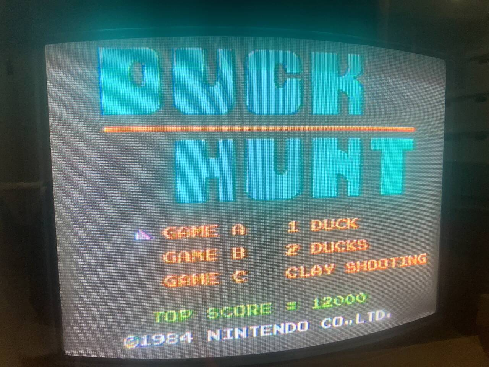
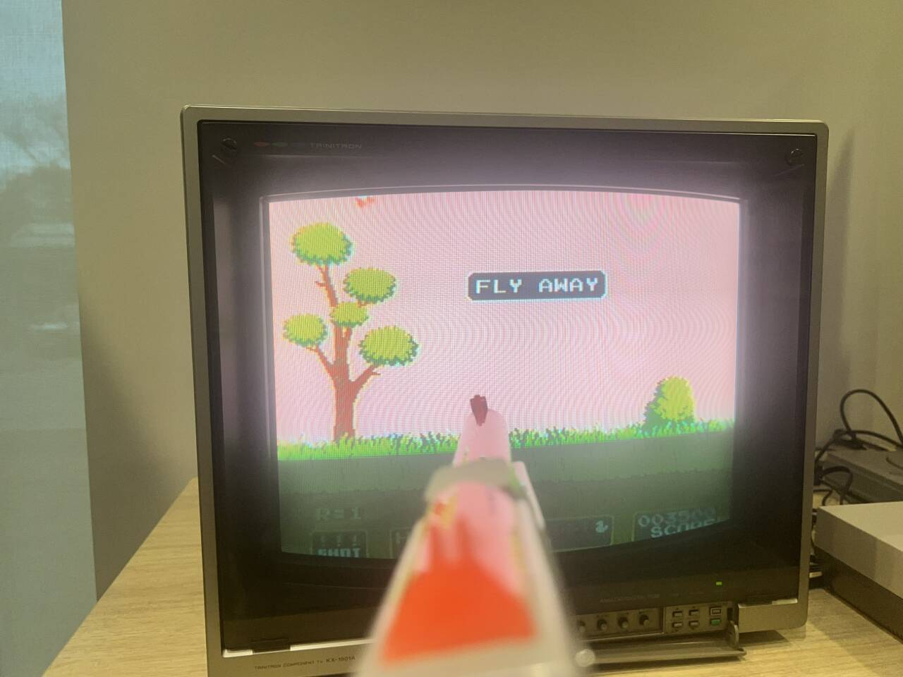
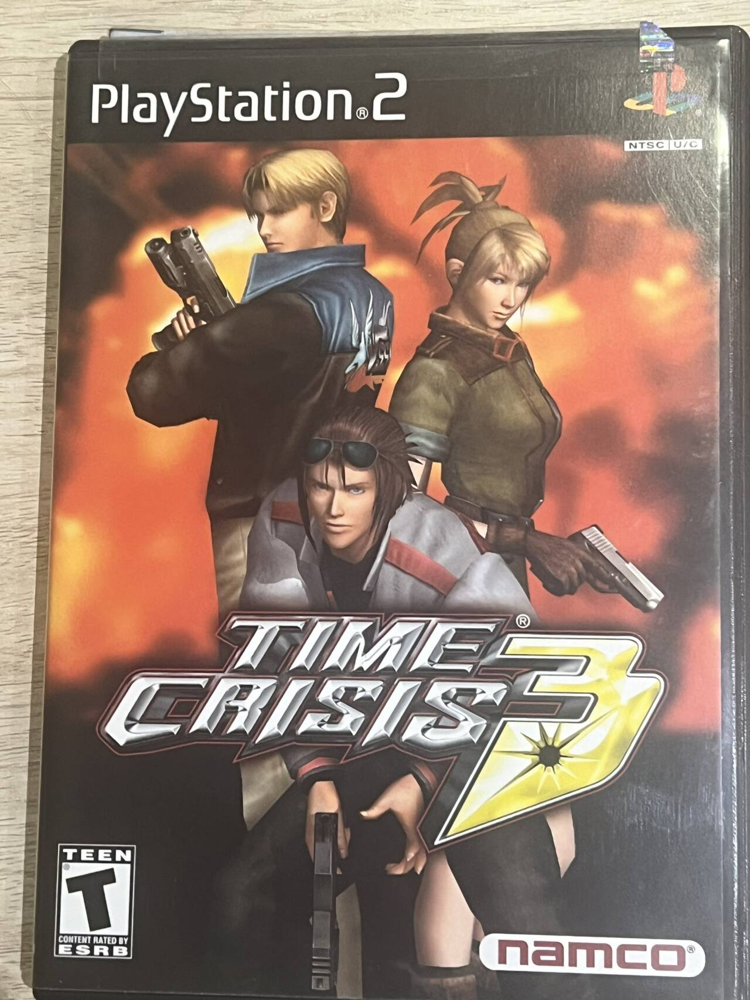
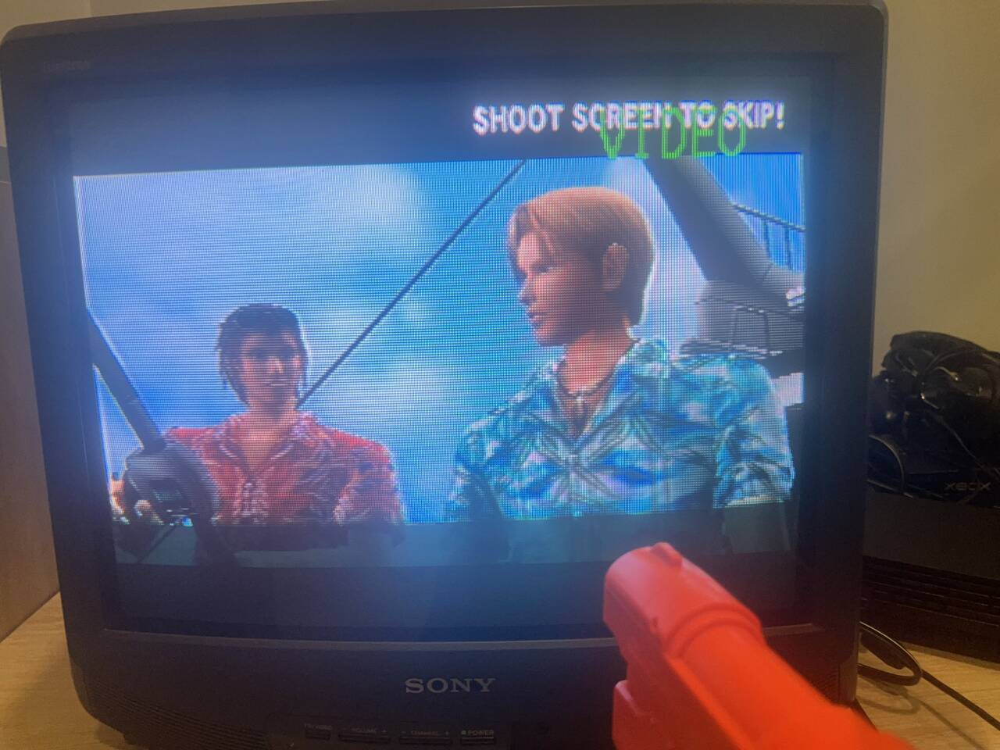

# From Light Gun Games to FPS Esports: The Shift from Play to Performance

## Introduction
In the living rooms of the 1980s and 1990s, the plastic light gun stood as a proud emblem of gaming culture—one of the most iconic peripherals in video game history. By lifting the gun, aiming it at the television, and pulling the trigger, players completed a direct circuit between body and screen—aim, shoot, respond. This tactile connection between physical motion and digital feedback recreated the logic of real firearms, offering an immersive shooting experience that defined an era.

Today, however, the light gun survives mostly as a collector’s relic, long vanished from the mainstream gaming market. When we speak of shooters now, we think of Counter-Strike: Global Offensive or Call of Duty, both relying on the abstract precision of the keyboard, mouse, or controller—devices far removed from the embodied realism of light gun play. The light gun’s fall from prominence was not merely a matter of obsolete technology; it reflected a profound shift in the logic of the gaming industry itself.

Around the mid-2000s, as networked play and esports culture rose in prominence, gaming’s design philosophy pivoted from the pursuit of realism and sensory immersion to the pursuit of measurable performance. The rise of post-industrial capitalism and digital standardization redefined how “skill” and “fun” were valued. The body, once a vital instrument of play, was replaced by abstract efficiency and optimization. Contemporary shooters like CS:GO or VALORANT no longer simulate the feel of firing a gun—they simulate the competitive precision of reaction time, aim tracking, and data-driven performance. Gaming ceased to be about playing and became about performing.

This digital exhibition traces the historical arc of that transformation through the lens of the light gun and its related technologies, from Atari to the PlayStation 2 era. By presenting fifteen artifacts—ranging from early electromechanical shooting toys and specialized controllers to late-era rhythm-shooter hybrids—the exhibit reveals how video games gradually evolved from immersive, experience-driven design toward quantifiable performance culture. 

The exhibit asks:
> how did “fun” become synonymous with efficiency?
> How did the physicality of early gaming interfaces give way to the abstracted, metrics-based logic of esports?

In doing so, it reconsiders the meaning of “interaction” in video game history. Early games invited the player to embody the experience—to act, to touch, to feel. Later games asked the player to master the system—to calculate, to optimize, to compete. What was once a child’s plaything became a site of digital labor. From the light gun’s flashing sensor to the esports player’s calibrated DPI mouse, this evolution marks not just a technical shift, but a cultural one: the transformation of gaming from a medium of joy to a measure of performance.

## Early Games: The Pursuit of Realistic Fun

### Ray-O-Lite (1930s)
The prototype of light gun technology can be traced back to before the birth of video games. In essence, it was a mechanical toy with interactive shooting functionality. According to Pinrepari.com (n.d.), the Ray-O-Lite Rifle, developed by the Seeburg Company, was a duck-shooting themed game device that laid the foundation for the core working principle of light guns: a small light bulb was installed inside a simulated gun body, and when the trigger was pulled, it emitted a beam of light. On the game’s mechanical setup, a moving duck model equipped with a light-sensitive tube detected whether it had been hit. When the player successfully hit the target, the device would simultaneously trigger flashing lights and sound effects, forming a complete interactive feedback loop.

This game accurately recreated the primitive yet immersive act of hunting. Players had to physically participate by waiting for the duck model to emerge from the grass before performing the shooting action. Unlike modern video games, this early device had no scoring system, level design, or difficulty balancing. Its core value lay in simulating a realistic hunting scene to deliver a purely sensory experience for the player.

*   Pinrepair.com. (n.d.). Ray-O-Lite rifle. Retrieved from https://www.pinrepair.com/arcade/rayolit.htm

### Indy 500 – Atari VCS (1977)
As an early racing game, Indianapolis 500 (Indy 500) featured a custom steering wheel controller as its core highlight. Accroding to the information from The Henry Ford Museum (n.d.), this controller was equipped with a 360-degree rotating dial, allowing players to achieve precise control over the in-game vehicle。

The player’s physical rotation of the wheel produced instant feedback in the form of corresponding steering responses from the car in the game, directly reflecting the early video game industry’s simple yet earnest pursuit of realistic driving experiences.

It is worth noting that Indianapolis 500 was the only commercial game compatible with this specific driving controller, and it could only run with this exclusive peripheral. Such a phenomenon was quite common in the early video game industry, where developing non-general-purpose controllers was regarded as a necessary measure to enhance gameplay experiences. At that time, the core of game design emphasized the “physical presence” of the player, and these dedicated peripherals were the key medium through which that sense of embodied interaction was achieved.

* The Henry Ford. (n.d.). Indy 500 Driving Controller (Atari VCS). Retrieved from https://www.thehenryford.org/collections-and-research/digital-collections/artifact/455866/

###  Star Raiders – Atari (1979) 

Star Raiders is a space combat simulation game that features an independent keyboard control panel and presents its gameplay from a first-person cockpit perspective (Wikipedia, n.d.). The core design philosophy of the game was to recreate the authentic operational experience of a pilot as closely as possible, thereby building a strong sense of immersion for the player. Due to the complexity of its keyboard-based control logic, the game was widely regarded within the industry as highly challenging.

Unlike modern games that typically feature a gentle difficulty curve, Star Raiders—along with many other early titles—was characterized by high difficulty and the absence of beginner guidance. Its relentless pursuit of “realistic simulation” led developers to deliberately increase operational difficulty to enhance immersion, a hallmark that would later define the early era of “hardcore gaming.”

*  Wikipedia. (n.d.). Star Raiders. In Wikipedia, The Free Encyclopedia. Retrieved from https://en.wikipedia.org/wiki/Star_Raider

###  Kaboom! – Atari VCS (1981) 
Kaboom! features an extremely simple control scheme: the player manipulates three buckets to catch falling bombs, and the game ends immediately if a single bomb is missed. The game was once described as possessing “ all the makings of a lame game” (GameFAQs, 2006) , yet it simultaneously captivated players with its highly addictive gameplay.

The release of Kaboom! signified a transitional moment in game design, marking the shift from a “simulation-driven culture” to a “fun-oriented culture.” Games during this period no longer aimed primarily to replicate real-world experiences, but rather to emphasize pure entertainment value. Titles of this kind were typically easy to learn and operate, requiring players to master just a single core skill—such as timing button presses—to experience enjoyment. As such gameplay mechanics became more refined and varied, video games began to enter a new stage of creative and cultural evolution.

*  GameFAQs. (2006, November 5). Kaboom! for Atari 2600 reviews. Retrieved from https://gamefaqs.gamespot.com/atari2600/584825-kaboom/reviews/123623

## The Rise of the Ligh Gun: from realism to fun
Modern shooting games are primarily designed to be compatible with mouse-and-keyboard or game controller inputs. In contrast, the emergence of early light gun games revolved entirely around the light gun as a “toy peripheral.” This distinction represents a core dividing line between the light gun era and earlier phases of gaming history — marking the shift of game design’s focus from purely immersive realism to a hybrid experience that balances immersion and playability.

### Wild Gunman – Nintendo NES (1984)

Wild Gunman was a Nintendo Famicom title developed exclusively for use with the console’s Beam Gun light gun peripheral. To promote this new accessory, Nintendo specifically created this Western-style dueling game, themed around classic cowboy shootouts. In gameplay, when an enemy’s eyes flash white and they shout “Fire!!”, the player must quickly pull the light gun’s trigger to shoot (Wikipedia, 2025).

In line with earlier “realism-driven” game design philosophies, the core appeal of Wild Gunman lay in providing players with an immersive experience that captured the intense tension of 19th-century American frontier gunfights. Its highly interactive mechanics not only heightened the sense of realism but also significantly enhanced the game’s entertainment value.

* Wikipedia contributors. (2025, October 20). Wild Gunman. Wikipedia. https://en.wikipedia.org/wiki/Wild_Gunman

### Duck Hunt - Nintendo NES (1984)

Duck Hunt was released just two months after the launch of the Beam Gun peripheral for Nintendo’s Famicom (Family Computer) and quickly became one of the most popular games of its time. The nameless hunting dog featured in the game soon became an iconic character, and Duck Hunt itself emerged as a definitive classic of the light gun genre (Wikipedia, 2025).

Like the earlier Ray-O-Lite, Duck Hunt was also hunting-themed, but as the medium evolved into the electronic era, the game introduced more complex rules, more engaging feedback, and higher-frequency interactions. Rather than striving for a purely realistic simulation, it embraced entertainment-oriented design—for example, when the player fails to shoot a duck, the mocking laughter animation of the hunting dog serves as a playful punishment mechanic, reinforcing the game’s humor and charm while enhancing player engagement.

* Nintendo, C. T. (n.d.). Duck Hunt. Nintendo. https://nintendo.fandom.com/wiki/Duck_Hunt
* Wikipedia contributors. (2025g, November 6). Duck Hunt. Wikipedia. https://en.wikipedia.org/wiki/Duck_Hunt

### Laser Invasion - Konami (1991)

Laser Invasion, developed by Konami and released in 1991 for the Nintendo Entertainment System (NES), is a multi-genre first-person action game that utilizes the NES Zapper light gun. Before each mission, players receive a briefing from the commander, outlining the next objective (Arnpoly, 2018). They then infiltrate enemy bases, complete specific missions, and attempt to escape successfully.

The game was praised as a hybrid experience that blended multiple gameplay genres, introducing more complex narratives and multidimensional mechanics to create a richer, more immersive experience. This marked a significant turning point in game design philosophy—signaling the industry’s transition from designing games around toys to designing games around player experience. Laser Invasion thus stands as a milestone in the evolution toward fully electronic, experience-driven gameplay design.

* Arnpoly. (2018, May 14). #75 – Laser Invasion. Take on the NES Library. https://takeontheneslibrary.com/finished/75-laser-invasion/

### The House of the Dead 2 - Sega Dreamcast (1998)

The House of the Dead 2 is one of the most iconic light gun shooting games on the SEGA Dreamcast platform and was later ported to PC. As a sequel to the original title, it retained many of its predecessor’s core elements—such as zombie shooting, a limited ammunition system, health management, and multiple branching paths.

By this stage, the evolution of light gun games had become evident: gameplay was growing increasingly complex and multidimensional. Accroding to The Wiki of the Dead (n.d.), Players were no longer tested solely on their shooting accuracy and reflexes, but were also required to engage with strategic decision-making, narrative progression, and resource management. This reflected a broader shift in design philosophy—from straightforward arcade-style shooting toward integrated, cinematic, and system-driven experiences that blended action with storytelling depth.

*  Dead, C. T. W. O. T. (n.d.). The House of the Dead 2. The Wiki of the Dead. https://thehouseofthedead.fandom.com/wiki/The_House_of_the_Dead_2

### Time Crisis - Namco (2003)
Time Crisis 3 can be regarded as one of the final high points of the light gun era. In the early 2000s, arcade light gun shooters were still active but already showing clear signs of decline. As noted in IGN’s E3 2003 coverage (Dunham, 2016), The game introduced a cinematic storyline, animated cutscenes, and a multi-weapon switching system, allowing players to choose between a handgun, submachine gun, shotgun, and grenade launcher depending on combat needs.

This design incorporated tactical strategy and single-player narrative depth, signaling an evolution beyond traditional point-and-shoot gameplay. While Time Crisis 3 remained fundamentally focused on shooting mechanics, with player freedom largely confined to reaction speed and aiming accuracy, its structured pacing and rhythmic mission design brought it closer to the conventions of modern game design. It represented a moment when light gun games achieved technical and experiential maturity, just before the genre’s gradual fade from mainstream popularity.

*  Dunham, J. (2016, June 30). E3 2003: Time Crisis 3 - IGN. IGN. https://www.ign.com/articles/2003/05/09/e3-2003-time-crisis-3-2

### Rez - PlaStation 2 (2001)

Rez is a groundbreaking game that fuses shooting mechanics with music-driven gameplay, enhanced by a unique peripheral known as the Trance Vibrator, which amplifies vibration and tactile feedback (Wikipedia, 2025). During gameplay, the player moves along predefined rails through each level, aiming and shooting at enemies that appear in sync with the rhythm and beats of the music.

Celebrated as an innovative experimental work, Rez went beyond the conventional limits of controller vibration. The designer sought to merge “music games” and “shooting games” into a unified sensory experience—transforming the concept of a “game” into a medium for holistic physical and emotional immersion. The Trance Vibrator served as the physical embodiment of this vision, extending the game’s sensory reach beyond the screen.

However, despite critical acclaim, Rez did not achieve significant commercial success. In contrast, a very different design philosophy—one focused on accessible, mass-market shooting gameplay rather than experimental sensory expression—rose to prominence. This divergence ultimately paved the way for the mainstream, household-famous shooting games that would define the genre in the years to come.

*  Wikipedia contributors. (2025a, September 15). Rez (video game). Wikipedia. https://en.wikipedia.org/wiki/Rez_(video_game)

## The Formation of an Efficiency Culture
While light gun games were providing players in arcades and living rooms with simple yet visceral sensory stimulation, the rise of the personal computer was quietly nurturing a revolution in interactive design. The combination of keyboard and mouse introduced an unprecedented level of precision and control: players could execute complex sequences with minimal input latency—shooting, movement, reloading, and aiming all became standardized, measurable, and optimizable actions.

As technology advanced, gaming culture itself began to shift toward performance-oriented values. The immediacy of physical, in-the-moment experience—once central to early interactive play—gradually gave way to systems that quantified achievement. Metrics such as scoreboards, statistics, and K/D/A ratios emerged as the new symbols of mastery and progress, marking a transition from embodied participation to data-driven competition at the heart of digital play.

### DOOM - id Software (1993)
As one of the most iconic FPS games ever created, DOOM exerted such a profound influence that, for a long period afterward, nearly all first-person shooters were collectively referred to as “DOOM-like” games.

DOOM stands as a landmark title in gaming history, widely regarded as the origin of modern first-person shooter (FPS) culture and the foundation of online multiplayer ecosystems. Unlike narrative-driven games of its time, DOOM deliberately deemphasized storytelling—reflecting designer John Carmack’s philosophy of “technology-driven design.”

Carmack believed that the fast-paced thrill of combat and instant gratification of kills were far more compelling than elaborate plots - "story in game is like story in a porn movie - the plot is expected to be there, but it's not that important", as he said (Carmack, as cited in Wikipedia, 2025). This approach led to the creation of the first true FPS deathmatch mode, a revolutionary concept that redefined how players could compete and interact in digital spaces. Through its technical innovation, modular design, and raw kinetic energy, DOOM not only set the template for future FPS games but also shaped the very culture of competitive, networked play that defines modern gaming.

* Wikipedia contributors. (2025c, October 26). Doom (1993 video game). Wikipedia. https://en.wikipedia.org/wiki/Doom_(1993_video_game)

### Quake III Arena - id Software (1999)

Quake III Arena, developed by id Software and released on December 2, 1999 for PC, stands as a spiritual successor to DOOM, carrying forward its relentless pursuit of fast-paced, high-intensity combat while fully embracing the emerging multiplayer era. Unlike its predecessors, which largely focused on single-player campaigns, Quake III Arena was almost entirely designed for competitive play—a radical shift in the philosophy of shooter design (Wikipedia, 2025).

Earlier FPS titles typically offered linear levels and narrative-driven progression, rewarding players for individual skill mastery in isolation. In contrast, Quake III Arena introduced open, multi-path maps and replayable multiplayer experiences, where enjoyment no longer came from being “better than one’s past self,” but from outperforming other human players. The game demanded not only precision and reflexes, but also strategic thinking, spatial awareness, and tactical coordination. As a result, the learning curve for players grew exponentially steeper, emphasizing dedication, practice, and mechanical discipline.

Quake III Arena became one of the first true online esports titles, laying the groundwork for a global competitive gaming culture. In the early 2000s, it helped spark the rise of professional tournaments, sponsored teams, and esports organizations, marking a pivotal moment in the transformation of video games from personal entertainment to spectator-driven digital sport.

*  Wikipedia contributors. (2025b, October 19). Quake III Arena. Wikipedia. https://en.wikipedia.org/wiki/Quake_III_Arena

### Unreal Tournament - Epic Games (1999)

Unreal Tournament, released in 1999, was built on the first generation of the legendary Unreal Engine and, like Quake III Arena, centered around first-person shooting and multiplayer competition. As described by Wikipedia (2025), However, while Quake III represented the rise of professional, high-skill esports, Unreal Tournament embodied a more democratized vision of competitive play—accessible, community-driven, and open to creativity.

Both these two titles signaled the genre’s full transition from single-player campaigns to network-based multiplayer experiences, redefining what it meant to “play” an FPS in the online era. What distinguished Unreal Tournament was its emphasis on openness and community culture: it actively encouraged user-generated content, allowing players to create and share their own maps, modes, and modifications.

This ethos was deeply rooted in the open-source spirit inherited from the DOOM era, where player tinkering and modding were seen as extensions of the creative process rather than deviations from it. The vibrant MOD community that grew around Unreal Tournament would go on to inspire and shape the next generation of mainstream, large-scale shooters, laying the foundation for the rise of iconic franchises and the birth of modern community-driven game development.

*  Wikipedia contributors. (2025b, October 3). Unreal tournament. Wikipedia. https://en.wikipedia.org/wiki/Unreal_Tournament

### CS:GO - Value (2012)
The Counter-Strike (CS) series, emerging alongside titles like Unreal Tournament and Quake III Arena, belongs to the same historical era of multiplayer FPS evolution—yet its style, philosophy, and design direction diverged dramatically. What began as a player-created mod for Half-Life gradually evolved into a standalone (Wikipedia, 2025), mainstream esports phenomenon, ultimately reshaping the landscape of competitive gaming.

Unlike the reflex-based, arena-style shooters of its contemporaries, Counter-Strike grounded itself in the real-world context of modern counter-terrorism. Its gameplay placed greater emphasis on team coordination, strategic planning, and resource management, shifting the focus from pure mechanical skill to collective tactics and communication. This made the game more accessible to a wider audience, turning competitive play from a niche, tech-savvy pursuit into a shared social experience. In this sense, Counter-Strike became the milestone marking the transition of competitive shooters from geek culture to the mainstream.

The release of Counter-Strike: Global Offensive 2 (CS2) in 2023, designed specifically for professional-level competition, further refined the series’ balance and competitive integrity. Today, the CS franchise represents far more than just a video game—it stands at the intersection of multiple industries: esports tournaments, gaming peripherals, hardware manufacturing, livestreaming, and social media ecosystems.

In this transformation, the goal of play itself has shifted. The primal joy once found in simply hitting a target—rooted in instinct and immediacy—has been replaced by the pursuit of measurable performance: rankings, statistics, sponsorships, and professional recognition. The FPS genre, in this sense, has undergone a capitalist rationalization, evolving from an embodied sensory experience into a structured system of achievement and productivity.

From that point onward, we might say that shooting games entered the adult world—a realm where play, competition, and industry converge into a single, highly rationalized cultural form.

* Wikipedia contributors. (2025b, September 19). Counter-Strike: Global Offensive. Wikipedia. https://en.wikipedia.org/wiki/Counter-Strike:_Global_Offensive
